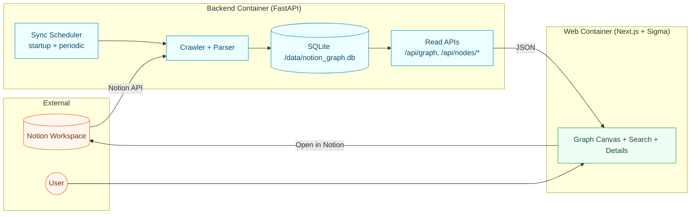
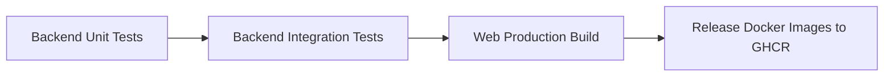

# Notion Graph (Docker-First)

Two-service app:

- `backend`: Python `FastAPI` + `SQLAlchemy` + `Alembic` + `SQLite`
- `web`: Next.js representative graph UI using Sigma.js

The backend reads `NOTION_ROOT_PAGE_ID` from env, performs startup full sync, then runs periodic reconcile, and also supports webhook-triggered incremental page reconcile.

Representative UI includes:
- collapsible search panel with grouped results and keyboard navigation
- graph filters for node type, selected-node depth, minimum degree, isolated-node hiding, and structured relation labels
- node detail panel with relation breakdown and open-in-Notion action
- `/admin` control plane for sync operations and metrics

## Architecture



## Quick Start

1. Create env file:

```bash
make env-init
```

2. Fill at least:

- `NOTION_TOKEN`
- `NOTION_ROOT_PAGE_ID`

3. Start services:

```bash
make real
```

4. Open:

- UI: `http://localhost:3000`
- Admin: `http://localhost:3000/admin`
- API health: `http://localhost:8000/api/health`

Required env for backend:
- `NOTION_TOKEN`
- `NOTION_ROOT_PAGE_ID`
- `ADMIN_API_KEY` (for admin endpoints and `/admin` dashboard)

Optional env:
- `NOTION_WEBHOOK_SECRET` (enables webhook signature verification)
- `SENTRY_DSN`, `SENTRY_ENVIRONMENT`, `SENTRY_TRACES_SAMPLE_RATE`

## Make Commands

Show all available commands:

```bash
make help
```

Common workflows:

```bash
# One-time bootstrap: env files + dependencies
make setup

# Run tests and lint
make test
make lint

# Local dev (no Docker)
make run-backend-demo   # backend fixture mode (no real Notion API)
make run-backend        # backend real mode (uses .env)
make run-web            # frontend on localhost:3000

# Docker demo/real stacks
make demo               # fixture mode in Docker
make real               # real Notion API mode in Docker
make replay-webhook-demo # send signed webhook using .env.demo secret
make replay-webhook      # send signed webhook using .env secret
make compose-down
```

Webhook replay knobs:
- `WEBHOOK_PAGE_ID` (default `alice_page`)
- `WEBHOOK_URL` (default `http://localhost:8000/api/webhooks/notion`)
- `WEBHOOK_PAYLOAD_FILE` (optional JSON file; if set, it overrides generated payload)

## Data Persistence

SQLite data is stored in named Docker volume `graph_data` mounted at `/data` in backend container.

## API (Read-only v1)

- `GET /api/graph`
- `GET /api/nodes/search?q=...`
- `GET /api/nodes/{id}`
- `GET /api/nodes/{id}/neighborhood?depth=1`
- `GET /api/health`

## API (Admin / Webhook)

- `GET /api/admin/sync/status` (requires `X-Admin-Api-Key`)
- `GET /api/admin/sync/tasks` (requires `X-Admin-Api-Key`)
- `POST /api/admin/sync/full` (requires `X-Admin-Api-Key`)
- `POST /api/admin/sync/pages/{page_id}` (requires `X-Admin-Api-Key`)
- `GET /api/admin/metrics` (requires `X-Admin-Api-Key`)
- `POST /api/webhooks/notion` (signature verified when `NOTION_WEBHOOK_SECRET` is set)

## CI/CD

GitHub Actions workflow: `.github/workflows/ci-release.yml`



Release job runs on `push` to `main` or tags `v*`.

## Local Development (without Docker)

### Backend

```bash
make run-backend-demo   # fixture mode
# or
make run-backend        # real mode
```

### Web

```bash
make run-web
```
